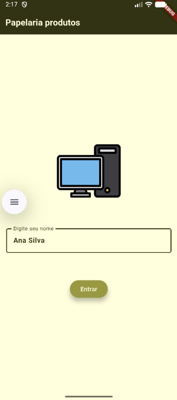
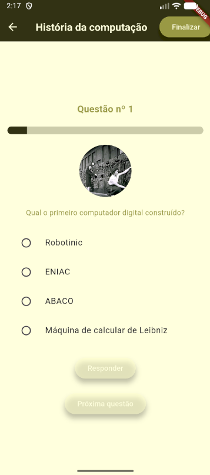
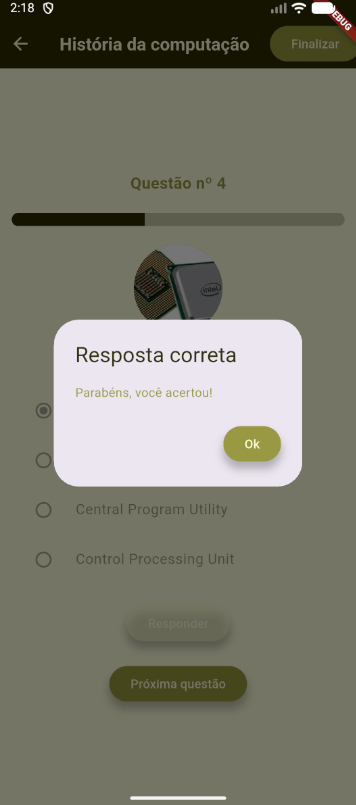
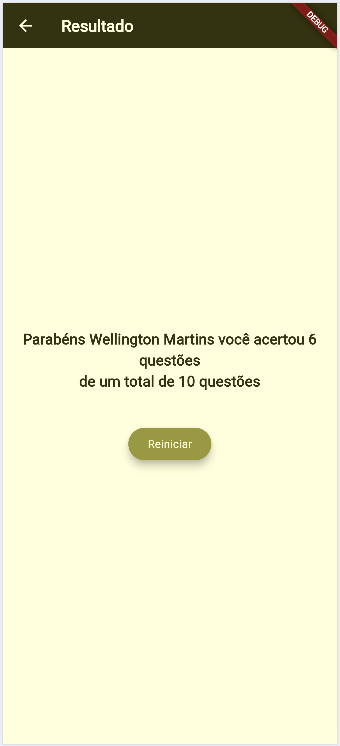

# Quiz História da Computação
Exemplo de um app flutter que **abre dados Mockup** JSON e cria um quiz, uma lista de perguntas sobre computação.<br>Exemplo de arquivos, estilização com paleta de cores e tema e radio buttons (Botões de opção).

## Tecnologias
- Flutter
- VsCode
- Android Studio

|Efeitos|WidGets|
|-|:-:|
|Tema|ThemeData.light().copyWith()|
|Imagens|Image.asset()|
|Assincronicidade|async|
|Carregar arquivos texto locais|rootBundle.loadString('assets/..');|
|Conversão de dados|json.encode(), json.decode()|
|Menu dropDown "Select"|DropdownButton<dynamic>()|
|Botões de controle de conteúdos em tela|ElevatedButton()|
|Botões de opção|RadioGroup()|

||||
|:-:|:-:|:-:|
|Splash|Home  Questão| Respondida|

|||
|:-:|:-:|
|Desabilitada|Resultado final|

## Para testar
- 1 Clone o repositório
- 2 Abra com VsCode, Abra o trminal **CTRL + "**, execute o comando `flutter pub get` para instalar as dependências
- 3 Navegue até o arquivo lib/main.dart e dê **play** ou execute o comando `flutter run` para rodar o projeto
- 4 Escolha navegador ou um emulador para testar, ou abra o arquivo */lib/main.dart* e clique em Play.
- O projeto irá abrir a tela de Splash com uma animação, clique em entrar e navegue pelos produtos.

## Atividade
Após estudar, executar e testar este projeto.
<br>Semelhante a este, agora em **Flutter** desenvolva o Quiz que já fez com **Mit App Inventor** no inicio das aulas de Mobile, digite suas questões no modelo JSON abaixo, porém acrescente mais questões, pelo menos 20 no seu quiz.
```json
[
    {
        "id": 1,
        "ilustracao":"https://admin.cnnbrasil.com.br/wp-content/uploads/sites/12/2021/06/26776_1798DEE935286D54.jpg?w=1024",
        "pergunta": "Qual o primeiro computador digital construído?",
        "respostas": [
            "Robotinic",
            "ENIAC",
            "ABACO",
            "Máquina de calcular de Leibniz"
        ],
        "correta": 2
    },
    {
        "id": 2,
        "ilustracao":"https://encrypted-tbn0.gstatic.com/images?q=tbn:ANd9GcRbppAC3zloJbY5EaWYgEllsV-gaoSzMlzzNw&s",
        "pergunta": "Quem é considerado o pai da computação?",
        "respostas": [
            "Alan Turing",
            "Charles Babbage",
            "Bill Gates",
            "Steve Jobs"
        ],
        "correta": 2
    },
    {
        "id": 3,
        "pergunta": "Qual foi a primeira linguagem de programação de alto nível?",
        "respostas": [
            "Assembly",
            "COBOL",
            "Fortran",
            "C"
        ],
        "correta": 3
    },
    {
        "id": 4,
        "ilustracao":"https://blogs.vmware.com/cloud-foundation/wp-content/uploads/sites/75/2025/06/Blog_CPU_Image.jpg?w=576&h=324&crop=1",
        "pergunta": "O que significa a sigla CPU?",
        "respostas": [
            "Central Processing Unit",
            "Computer Personal Unit",
            "Central Program Utility",
            "Control Processing Unit"
        ],
        "correta": 1
    },
    {
        "id": 5,
        "iustracao":"https://itonlineblog.wordpress.com/wp-content/uploads/2013/10/windows_xp_logo.jpg",
        "pergunta": "Qual empresa criou o sistema operacional Windows?",
        "respostas": [
            "Apple",
            "Google",
            "Microsoft",
            "IBM"
        ],
        "correta": 3
    },
    {
        "id": 6,
        "pergunta": "Qual destes é um dispositivo de entrada?",
        "respostas": [
            "Monitor",
            "Teclado",
            "Impressora",
            "Caixa de som"
        ],
        "correta": 2
    },
    {
        "id": 7,
        "ilustracao":"https://www.leansolutions.com.br/wp-content/uploads/2024/06/blog-excel.webp",
        "pergunta": "Qual destes é um sistema operacional?",
        "respostas": [
            "Linux",
            "Photoshop",
            "Excel",
            "Chrome"
        ],
        "correta": 1
    },
    {
        "id": 8,
        "ilustracao":"https://upload.wikimedia.org/wikipedia/commons/thumb/6/61/HTML5_logo_and_wordmark.svg/250px-HTML5_logo_and_wordmark.svg.png",
        "pergunta": "Qual linguagem é usada principalmente para desenvolvimento web?",
        "respostas": [
            "Python",
            "Java",
            "HTML",
            "C++"
        ],
        "correta": 3
    },
    {
        "id": 9,
        "ilustracao":"https://encrypted-tbn0.gstatic.com/images?q=tbn:ANd9GcRcg5mDSUBfRIqx_Qxc7cXdzQjLCtp8AoeJ2w&s",
        "pergunta": "O que é um byte?",
        "respostas": [
            "Um conjunto de 4 bits",
            "Um conjunto de 8 bits",
            "Um conjunto de 16 bits",
            "Um conjunto de 32 bits"
        ],
        "correta": 2
    },
    {
        "id": 10,
        "ilustracao":"https://static.wikia.nocookie.net/logopedia/images/1/13/Iegummi.png/revision/latest/scale-to-width-down/250?cb=20250520043056",
        "pergunta": "Qual destes é um navegador de internet?",
        "respostas": [
            "Windows",
            "Android",
            "Google Chrome",
            "Linux"
        ],
        "correta": 3
    }
]
```
